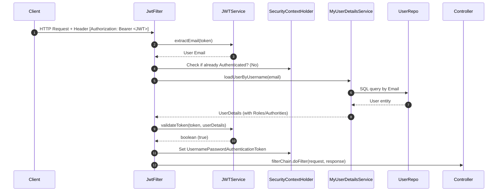

# 🎯 High-Performance Multi-Vendor E-commerce Backend
## 🧠 Technical Interview Q&A Preparation Guide

This document contains deep-dive, senior-level technical interview questions and comprehensive answers based on the architectural design, security protocols, and concurrency patterns implemented in this multi-vendor eCommerce backend.

---

## 📂 Table of Contents
1. [Concurrency & Concurrency Control (Race Conditions & Locks)](#1-concurrency--concurrency-control-race-conditions--locks)
2. [Transactional Boundaries & State Machine Reliability](#2-transactional-boundaries--state-machine-reliability)
3. [Stateless Authentication & Spring Security Architecture](#3-stateless-authentication--spring-security-architecture)
4. [Asynchronous Webhooks, Stripe Integration & Idempotency](#4-asynchronous-webhooks-stripe-integration--idempotency)
5. [Hibernate, JPA, & Performance Optimization](#5-hibernate-jpa--performance-optimization)

---

## 1. Concurrency & Concurrency Control (Race Conditions & Locks)

### Q1: How does your system prevent the "Double-Spending" or "Overselling" problem when thousands of users concurrently checkout the last remaining stock of a popular item (e.g., during a flash sale)?
**Answer:**
The system implements a **dual-layer stock protection and concurrency control architecture**:
1. **Layer 1: High-Performance In-Memory Pre-Allocation (Redis)**
   * Every product stock level is synchronized to a Redis cache key (`product:stock:{id}`) upon application startup (`@PostConstruct` inside `RedisStockService`).
   * When a checkout starts, the system performs an atomic decrement using Redis `DECRBY` (`redisTemplate.opsForValue().decrement(key, quantity)`). 
   * Redis operations are single-threaded and atomic. If the resulting decrement value is negative, the reservation fails, the stock is immediately incremented back to its original state, and an `Insufficient stock` exception is thrown. This filters out 99% of requests at the cache layer with sub-millisecond latency, preventing DB CPU exhaustion.
2. **Layer 2: Strong ACID Consistency (PostgreSQL Pessimistic Locking)**
   * To ensure strict consistency and prevent discrepancies between Redis and the database, the transaction obtains a **Pessimistic Write Lock** (`@Lock(LockModeType.PESSIMISTIC_WRITE)`) on the specific product row in PostgreSQL.
   * This is declared inside `ProductRepo.findByIdForUpdate(productId)`:
     ```java
     @Lock(LockModeType.PESSIMISTIC_WRITE)
     @Query("SELECT p FROM Product p WHERE p.id = :id")
     Optional<Product> findByIdForUpdate(@Param("id") Long id);
     ```
   * The database executes a `SELECT ... FOR UPDATE` query, blocking any concurrent transactions from reading or writing that row until the outer checkout transaction commits or rolls back. Inside this secure block, the DB stock is decremented.

---

### Q2: What is the difference between `@Lock(LockModeType.PESSIMISTIC_WRITE)` and `@Version` (Optimistic Locking) in Spring Data JPA? Why did you choose Pessimistic Locking for order creation?
**Answer:**
* **Optimistic Locking (`@Version`):**
  * **Mechanism:** Relies on a version column in the database. When updating, JPA runs `UPDATE table SET stock = new_stock, version = version + 1 WHERE id = :id AND version = :old_version`.
  * **Behavior:** If a concurrent transaction modified the row in the meantime, the version mismatch causes an `OptimisticLockException`. The transaction fails and must be retried by the application.
  * **Trade-off:** Excellent for **low-contention read-heavy systems**, as it has no database locking overhead. However, in **high-contention scenarios** (e.g., flash sales), it results in massive transaction failures and excessive retry loops, leading to a terrible user experience.
* **Pessimistic Locking (`@Lock(LockModeType.PESSIMISTIC_WRITE)`):**
  * **Mechanism:** Obtains an exclusive database-level row lock using `SELECT ... FOR UPDATE`.
  * **Behavior:** Concurrent checkout requests for the *same* product are placed in a queue at the database driver/engine level. They execute sequentially and safely.
  * **Why we chose it:** In an e-commerce checkout flow, stock deduction is **high-contention**. Failing checkouts due to optimistic version collisions is unacceptable. Pessimistic locking ensures that if stock is physically available in the database, the transaction succeeds cleanly without requiring manual application retries. Combined with the **Redis pre-allocation layer**, the lock wait time is minimized because requests that would fail due to no stock never even reach the database lock stage.

---

### Q3: Suppose the Redis stock reservation succeeds, but the PostgreSQL pessimistic write lock block fails or throws an exception. How does your system ensure the Redis cache does not drift and leak stock permanently?
**Answer:**
This is solved by custom programmatic rollback handlers inside a `@Transactional` boundary in `OrderService.createOrder()`:
```java
// Inside createOrder...
for (CartItem cartItem : cart.getItems()) {
    Long productId = cartItem.getProduct().getId();

    // 1. Redis Reservation (Fast Layer)
    boolean reserved = redisStockService.reserveStock(productId, cartItem.getQuantity());
    if (!reserved) {
        // Rollback already completed reservations for previous items in this cart!
        rollbackRedisReservations(orderItems);
        throw new IllegalStateException("Insufficient stock for: " + cartItem.getProduct().getName());
    }

    try {
        // 2. DB Lock & Deduction (Strong Consistency)
        Product product = productRepo.findByIdForUpdate(productId)
                .orElseThrow(() -> new IllegalStateException("Product not found"));

        if (product.getStock() < cartItem.getQuantity()) {
            // Rollback this specific item's Redis cache pre-allocation
            redisStockService.incrementStock(productId, cartItem.getQuantity());
            throw new IllegalStateException("Stock mismatch: " + product.getName());
        }
        
        product.setStock(product.getStock() - cartItem.getQuantity());
        // build OrderItem and add to list...
    } catch (Exception e) {
        // Rollback ALL Redis reservations completed so far in this checkout loop
        rollbackRedisReservations(orderItems);
        throw e; // Reraise exception to trigger database Spring @Transactional rollback
    }
}
```
**Mechanism explanation:**
1. **Redis Rollback:** If a database verification or stock check fails midway through the loop, the catch block calls `rollbackRedisReservations()`, iterating through already-processed `OrderItem`s and calling `redisStockService.incrementStock(productId, quantity)` to restore the cached stock.
2. **Database Rollback:** The exception is rethrown out of the `@Transactional` method. Spring's transaction manager intercepts the exception, sends a `ROLLBACK` command to PostgreSQL, restoring the original stock levels and discarding any uncommitted order entity creations.

---

## 2. Transactional Boundaries & State Machine Reliability

### Q4: Explain the order state machine transition validations. How do you prevent invalid transitions (e.g., jumping from `CREATED` directly to `SHIPPED` without payment)?
**Answer:**
State transitions are strictly governed by a declarative validation map inside `OrderService.updateOrderStatus()`. This represents a robust state machine pattern:

```java
private void validateStateTransition(OrderStatus current, OrderStatus next) {
    Map<OrderStatus, List<OrderStatus>> validTransitions = Map.of(
        OrderStatus.CREATED, List.of(OrderStatus.PAYMENT_PENDING, OrderStatus.CANCELLED),
        OrderStatus.PAYMENT_PENDING, List.of(OrderStatus.PAID, OrderStatus.CANCELLED),
        OrderStatus.PAID, List.of(OrderStatus.SHIPPED, OrderStatus.CANCELLED),
        OrderStatus.SHIPPED, List.of(OrderStatus.DELIVERED),
        OrderStatus.DELIVERED, List.of(),
        OrderStatus.CANCELLED, List.of()
    );

    if (!validTransitions.getOrDefault(current, List.of()).contains(next)) {
        throw new IllegalStateException("Invalid state transition: " + current + " → " + next);
    }
}
```
**Benefits:**
* **Safety:** Prevents administrative errors or API exploitation from skipping payments or bypassing logical workflows.
* **Stock Release Hook:** When the state machine transitions to `CANCELLED`, the system automatically calls `releaseStock()`, which increments both the SQL database columns and the Redis cache counters for all items inside the order, restoring global stock availability.

---

### Q5: How does the system handle "Abandoned Checkout" scenarios where a customer creates an order but never completes the Stripe checkout?
**Answer:**
We implement an **Automated Stock & Order Reclamation Engine** using Spring's scheduling framework (`@Scheduled`):
1. **Reservation Expiry Time:** When an order is created, its status is set to `CREATED` and a `reservedUntil` timestamp is calculated (set to 15 minutes into the future: `LocalDateTime.now().plusMinutes(15)`).
2. **CRON Cleanup Task:** Inside `OrderService`, a background task runs every 60 seconds:
   ```java
   @Transactional
   @Scheduled(fixedRate = 60000)
   public void cancelExpiredOrders() {
       List<Order> expiredOrders = orderRepo.findByStatusInAndReservedUntilBefore(
               List.of(OrderStatus.CREATED, OrderStatus.PAYMENT_PENDING),
               LocalDateTime.now()
       );

       for (Order order : expiredOrders) {
           updateOrderStatus(order.getId(), OrderStatus.CANCELLED);
       }
   }
   ```
3. **Execution Safety:** The `updateOrderStatus` method transitions the expired orders to `CANCELLED`, releasing the reserved stocks in both PostgreSQL and Redis cache dynamically.

---

### Q6: What are the architectural limitations of `@Scheduled` in a multi-instance (clustered) production deployment? How would you solve it?
**Answer:**
* **Limitations of default `@Scheduled`:**
  * **Duplicate Executions:** If you deploy 3 instances of the backend service behind a Load Balancer, all 3 nodes will run their own scheduler thread every 60 seconds. This leads to redundant SQL queries, thread contention, database lock locks, and potential race conditions when updating the same order statuses.
* **Production-Grade Solutions:**
  1. **Distributed Locks via ShedLock:** 
     * Integrate a library like **ShedLock** with Redis or JDBC as a provider. ShedLock stores the scheduled task's execution state in a shared lock register.
     * When the schedule ticks, the first instance to acquire the lock runs the task, while other instances immediately skip execution.
  2. **Dedicated Task Scheduler / Message Broker:**
     * Use a system like **Quartz Scheduler** clustered mode.
     * Or, emit a delayed message to an **ActiveMQ / RabbitMQ** queue or a **Redis keyspace event listener** (with TTL) when the order is created. When the TTL expires, a consumer wakes up, checks if the order is still unpaid, and cancels it.

---

## 3. Stateless Authentication & Spring Security Architecture

### Q7: Describe the request filtering and authentication lifecycle when a client sends a request with a JWT token.
**Answer:**

1. **Intercept Request:** The request passes through the Spring Security Filter Chain. `JwtFilter` (extending `OncePerRequestFilter`) intercepts the HTTP request and checks the `Authorization` header.
2. **Extract Token & Claims:** If it starts with `"Bearer "`, it strips the prefix to extract the raw JWT. It invokes `jwtService.extractEmail(token)` which cryptographically parses the token claims.
3. **Validate Authenticity:** If the email is extracted successfully and the Spring `SecurityContextHolder` has no existing authentication for this thread:
   * It loads the latest user data from the database using `MyUserDetailsService.loadUserByUsername(email)`.
   * It validates that the token is not expired and the subject matches the DB username using `jwtService.validateToken(token, userDetails)`.
4. **Context Injection:** It instantiates a `UsernamePasswordAuthenticationToken` loaded with the user's `GrantedAuthorities` (e.g. `ROLE_CUSTOMER`, `ROLE_VENDOR`).
5. **Security Context Storage:** It stores this authentication token in the thread-local `SecurityContextHolder`.
6. **Execution Forwarding:** The request is passed to the remaining security filters and ultimately mapped to the designated REST controller endpoint.

---

### Q8: In `JWTService`, the signing secret key is dynamically generated in the class constructor (`KeyGenerator.getInstance("HmacSHA256")`). What are the trade-offs of this approach?
**Answer:**
```java
public JWTService() {
    try {
        KeyGenerator keyGen = KeyGenerator.getInstance("HmacSHA256");
        SecretKey sk = keyGen.generateKey();
        secretkey = Base64.getEncoder().encodeToString(sk.getEncoded());
    } catch (NoSuchAlgorithmException e) {
        throw new RuntimeException(e);
    }
}
```
* **Advantages:**
  * **Ultra Secure locally:** No hardcoded secret keys in the codebase or git repositories, preventing credential leakage.
  * **Zero Setup:** Boots instantly out-of-the-box without requiring custom environment variables.
* **Disadvantages (Severe for Clustered / Scaled Deployments):**
  * **No Scaling (Stateful In-Memory Behavior):** If the application scales to 2+ instances, each server will generate a **completely different secret key** in memory. A JWT generated by Server A will be rejected as invalid/forged by Server B, causing random `403 Forbidden` errors for users as requests route between servers.
  * **Invalidation on Restart:** If the single server restarts, the key changes. All active logged-in users have their tokens instantly invalidated, forcing them to log in again.
* **How to fix for Production:**
  * Externalize the secret key config to `application.properties` and read it using `@Value("${app.jwt.secret}")`.
  * Store it in a secure environment variable or a secrets vault (e.g., **AWS Secrets Manager**, **HashiCorp Vault**).
  * Use a shared symmetric key or configure asymmetric **RSA Public/Private Keys** where the auth server signs with the private key, and the resource servers verify with the public key.

---

## 4. Asynchronous Webhooks, Stripe Integration & Idempotency

### Q9: Webhooks are external ingress points vulnerable to Spoofing. How does your `WebhookController` guarantee the incoming Stripe payment notification is authentic?
**Answer:**
We implement two strict cryptographic and validation checks inside `WebhookController.handleStripeEvent()`:
1. **Cryptographic Signature Verification:**
   * We retrieve the `Stripe-Signature` header from the request.
   * We pass the raw HTTP request body payload, the signature header, and a secret webhook token (`stripe.webhook.secret`) to Stripe's validator:
     ```java
     event = Webhook.constructEvent(payload, sigHeader, endpointSecret);
     ```
   * This uses HMAC SHA-256 validation. If an attacker tries to spoof the request, the signature verification fails, throwing a `SignatureVerificationException`, which returns a `400 Bad Request` and terminates immediately.
2. **App-Name Isolation Check:**
   * During the payment intent creation, we inject the application's unique ID into the Stripe metadata payload: `.putMetadata("app_name", appName)`.
   * Upon receiving the webhook, we verify this metadata:
     ```java
     String intentAppName = paymentIntent.getMetadata().get("app_name");
     if (!appName.equals(intentAppName)) {
         log.info("Ignoring event for different app: " + intentAppName);
         return ResponseEntity.ok(""); // Safely ignore without failing Stripe's retry queue
     }
     ```

---

### Q10: Stripe webhooks have "at-least-once" delivery guarantees, meaning Stripe can send the duplicate `payment_intent.succeeded` event multiple times. How do you implement idempotency to avoid updating wallets and recording ledger records twice?
**Answer:**
We achieve transactional idempotency using a state-and-data checking approach inside a `@Transactional` block:
```java
@Transactional
public void handlePaymentSuccess(PaymentIntent paymentIntent) {
    String paymentIntentId = paymentIntent.getId();
    Payment payment = paymentRepo.findByPaymentReference(paymentIntentId);

    if (payment != null) {
        // Idempotency Check:
        if (payment.getPaymentStatus() == PaymentStatus.SUCCESS) {
            log.info("Payment already processed. Skipping duplicate hook.");
            return; // Exit safely
        }

        // Proceed to update status
        payment.setPaymentStatus(PaymentStatus.SUCCESS);
        paymentRepo.save(payment);

        Order order = payment.getOrder();
        order.setStatus(OrderStatus.PAID);
        orderRepo.save(order);
        
        // Trigger multi-vendor commission payouts safely
        commissionService.distributeCommission(order.getId());
    }
}
```
**Why this works:**
* **Database State Check:** Since the method is `@Transactional`, Hibernate locks the payment row during read. The system reads the current state. If the status is already `SUCCESS`, it exits early, ignoring the duplicate request.
* **Atomic Wallet Update:** The wallet balance adjustment and commission log insertions are part of the *same* database transaction. If the transaction completes, the state changes to `SUCCESS`, making all future webhook callbacks for this ID bounce off the early return statement.

---

### Q11: How does the `CommissionService` split the customer's payment across multiple vendors asynchronously? Provide the mathematical ledger breakdown.
**Answer:**
An order can contain items from multiple distinct vendors. When an order transitions to `PAID`, `CommissionService` calculates commission splits on an individual line-item basis:
1. **Commission Configuration:** Platform takes a configured cut (e.g., 10% commission: `COMMISSION_RATE = 0.10`).
2. **Dynamic Distribution Loop:**
   ```java
   for (OrderItem item : order.getItems()) {
       Vendor vendor = item.getVendor();
       BigDecimal totalItemPrice = BigDecimal.valueOf(item.getTotalPrice());

       BigDecimal commissionAmount = totalItemPrice.multiply(COMMISSION_RATE); // 10%
       BigDecimal netAmount = totalItemPrice.subtract(commissionAmount);        // 90%

       // 1. Credit Vendor Wallet Balance
       VendorWallet wallet = vendorWalletRepository.findByVendorId(vendor.getId()).orElseThrow();
       wallet.setBalance(wallet.getBalance().add(netAmount));
       vendorWalletRepository.save(wallet);

       // 2. Write Audit Ledger (Immutable)
       VendorTransaction transaction = VendorTransaction.builder()
               .vendor(vendor)
               .order(order)
               .amount(totalItemPrice)
               .commission(commissionAmount)
               .netAmount(netAmount)
               .build();
       vendorTransactionRepository.save(transaction);
   }
   ```
#### 📊 Ledger Example:
Suppose a customer buys:
* **Item A (Vendor X):** $100.00
* **Item B (Vendor Y):** $50.00
* **Total Order:** $150.00

The service processes each item:
* **For Item A (Vendor X):**
  * Gross Amount: `$100.00`
  * Platform Commission (10%): `$10.00`
  * Vendor Net Credit (90%): `$90.00` added to Vendor X's Wallet.
  * Audit Transaction row recorded for Vendor X.
* **For Item B (Vendor Y):**
  * Gross Amount: `$50.00`
  * Platform Commission (10%): `$5.00`
  * Vendor Net Credit (90%): `$45.00` added to Vendor Y's Wallet.
  * Audit Transaction row recorded for Vendor Y.
* **Global Outcome:** Customer paid $150. Vendors receive $135 combined. The platform keeps $15 as platform revenue.

---

## 5. Hibernate, JPA, & Performance Optimization

### Q12: What is the "N+1 SELECT" query problem in Spring Data JPA? Where could it happen in your codebase, and how do you prevent it?
**Answer:**
* **The Problem:**
  * Occurs when you fetch a parent entity (e.g., fetching 10 `Order`s) and then loop through them to access their child entities (e.g., accessing `order.getItems()`).
  * If the relationship is lazy-loaded (default for `@OneToMany`), Hibernate executes **1 initial query** to load all orders, and then **N additional queries** to fetch the items for *each* of the N orders individually. This rapidly destroys database performance.
* **Where it could happen:**
  * Fetching all orders for administration via `orderRepo.findAll()` and mapping them to `OrderDto` (which iterates over `order.getItems()`).
* **Prevention Strategies:**
  1. **Fetch Join (JPQL):**
     Using custom JPQL query with `JOIN FETCH` to load parents and children in a single SQL query:
     ```java
     @Query("SELECT DISTINCT o FROM Order o LEFT JOIN FETCH o.items")
     List<Order> findAllWithItems();
     ```
  2. **Entity Graphs (`@EntityGraph`):**
     Declaring the association to eagerly fetch directly on the repository method:
     ```java
     @EntityGraph(attributePaths = {"items"})
     List<Order> findAll();
     ```

---

### Q13: Why does `OrderItem` contain a `priceAtPurchase` field when the `Product` entity already has a `price` field? What design principle does this follow?
**Answer:**
* **Relational Integrity and Audit-Safety:**
  * A store's product prices are highly volatile (e.g., sales, inflation, price updates). 
  * If the price of a Product changes from $100 to $120 next month, we cannot change the price on orders placed in the past. If the order item references only `product.getPrice()`, looking up the order details in the future would display an incorrect historical total amount and corrupt all financial ledger calculations.
  * Therefore, during order placement, the system copies the current product price into an immutable, snapshot column `priceAtPurchase` inside the `order_items` table.
* **Design Principle:**
  * This follows the database design principle of **Historical Snapshotting** (denormalization of volatile attributes in transactional tables) to maintain data immutability and precise auditing capability.

---

### Q14: Explain the differences between `CascadeType.ALL` and `orphanRemoval = true` in the relationship between `Cart` and `CartItem`.
**Answer:**
```java
@OneToMany(mappedBy = "cart", cascade = CascadeType.ALL, orphanRemoval = true)
private List<CartItem> items;
```
* **`CascadeType.ALL`:**
  * Propagates all entity state transitions from the parent (`Cart`) to its children (`CartItem`).
  * If the `Cart` is saved (`persist`/`merge`), all associated `CartItem`s are saved automatically. If the `Cart` is deleted (`remove`), all its items are deleted automatically from the database.
* **`orphanRemoval = true`:**
  * Controls the lifecycle of child entities when their **relationship pointer is severed** from the parent entity.
  * If you remove an item from the Java List: `cart.getItems().remove(0)`, and save the `Cart`, Hibernate detects that a child has been dereferenced from the parent relationship and automatically issues an SQL `DELETE` query to wipe that specific `CartItem` row from the database.
  * Without `orphanRemoval = true`, removing the item from the collection would leave the child row orphaned in the database with a null `cart_id` foreign key, leading to database bloat and orphan data leaks.
