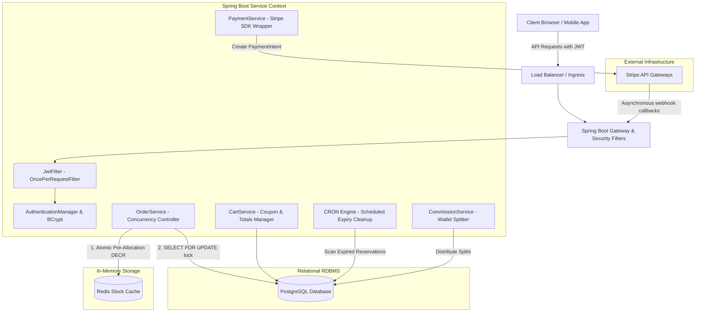
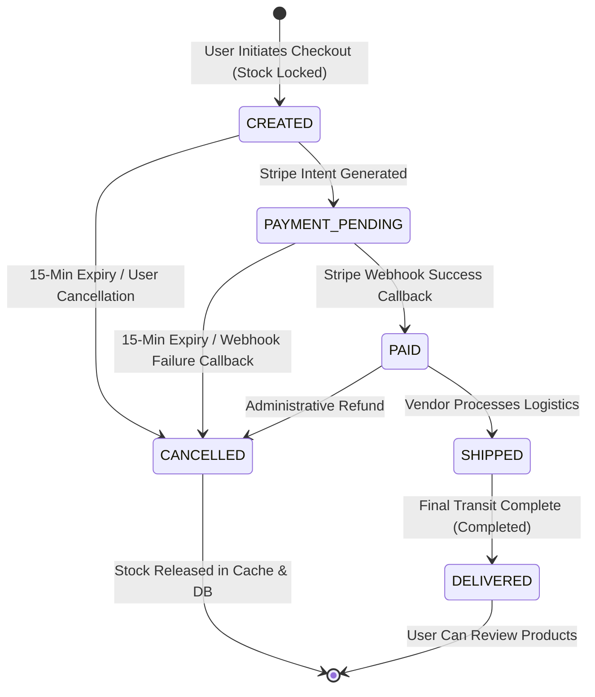

<div align="center">
  

  # 🛍️ Spring Boot Multi-Vendor E-Commerce Platform
  <p><strong>A production-grade, highly scalable backend engine for distributed multi-vendor marketplaces.</strong></p>

  <p>
    
    
    
    
    
    
    
  </p>
</div>

---

## 📖 Project Overview

This repository contains the backend core for an enterprise-level, high-concurrency Multi-Vendor E-Commerce platform built with **Spring Boot 3.1.x** and **Java 17**. 

Unlike standard monolithic single-retailer setups, this platform is specifically designed to tackle the unique operational and engineering challenges of high-volume, multi-vendor marketplaces. Key highlights include **thread-safe stock pre-allocation caches**, **strict database-level pessimistic serialization locks**, **automated asynchronous order status managers**, and a **cryptographically secure payment-ledger system** integrated with Stripe.

### 🌟 Business Logic Capabilities
*   **Multi-Vendor Separation:** Orders containing items from multiple distinct vendors are dynamically partitioned, allowing vendors to only view, process, and ship items belonging to their inventory.
*   **Dual-Tier Inventory Protection:** Prevents overselling during high-concurrency traffic bursts (such as flash sales) via a combined Redis allocation lock and a database pessimistic update lock.
*   **Platform Commissions:** Automatic, real-time commission split (10% platform, 90% vendor) credited into virtual wallets with dynamic transaction ledgers on confirmed checkout.
*   **Secure Payment Ingress:** Stripe checkout session creation with asymmetric webhook validation to eliminate client-side state manipulation vulnerability.

---

## 🏗️ System Architecture & Engineering Highlights



---

## 🚀 Deep-Dive: Core Technical Design Patterns

### 1. Dual-Layer Inventory & Concurrency Protection
To safely manage global stock deductions across highly concurrent checkout processes (e.g., flash sales) without causing race conditions (Overselling / Double-spending), the system implements a **Dual-Layer Locking Mechanism**:

*   **Layer 1: Lock-Free Pre-Allocation (Redis Caching)**
    Before accessing the SQL database, the checkout request is validated against an atomic pre-allocation counter in Redis. When the application starts up, stock amounts are synced from the PostgreSQL rows into Redis using `@PostConstruct`.
    ```java
    public boolean reserveStock(Long productId, int quantity) {
        String key = "product:stock:" + productId;
        Long remaining = redisTemplate.opsForValue().decrement(key, quantity);
        if (remaining == null || remaining < 0) {
            // Revert decrement if stock becomes negative
            redisTemplate.opsForValue().increment(key, quantity);
            return false;
        }
        return true;
    }
    ```
*   **Layer 2: Strong ACID Database Lock (PostgreSQL Pessimistic Write)**
    If Redis stock pre-allocation succeeds, the system proceeds to acquire a database row-level lock within a `@Transactional` block. This blocks all concurrent threads from updating the stock of the selected row.
    ```java
    @Lock(LockModeType.PESSIMISTIC_WRITE)
    @Query("SELECT p FROM Product p WHERE p.id = :id")
    Optional<Product> findByIdForUpdate(@Param("id") Long id);
    ```
*   **Self-Healing Fallbacks:** If the database updates throw an error or report a mismatch (e.g., product deleted during checkout), the cache counter is immediately incremented back programmatically, ensuring stock-cache synchronization alignment.

---

### 2. State-Machine Driven Order Lifecycle
Orders travel along a highly secure state transition matrix. Direct jumps (e.g., bypassing payments or shipments) are forbidden and block execution with an `IllegalStateException`.



#### Automated CRON Stock & Order Reclamation
To prevent inventory locks caused by abandoned checkouts, a background thread scans the database every 60 seconds:
```java
@Transactional
@Scheduled(fixedRate = 60000)
public void cancelExpiredOrders() {
    List<Order> expiredOrders = orderRepo.findByStatusInAndReservedUntilBefore(
            List.of(OrderStatus.CREATED, OrderStatus.PAYMENT_PENDING),
            LocalDateTime.now()
    );
    for (Order order : expiredOrders) {
        updateOrderStatus(order.getId(), OrderStatus.CANCELLED);
    }
}
```
When an order transitions to `CANCELLED`, the system automatically increments both the PostgreSQL inventory counts and the corresponding Redis keys.

---

### 3. Secured Asynchronous Webhooks & Idempotent Processing
Stripe handles payments asynchronously and calls the backend webhook `/stripe/webhook`.
*   **Cryptographic Webhook Signature:** The backend checks the signature of the incoming webhook using Stripe's dynamic SDK payload validation to prevent IP spoofing or forged requests.
*   **Application Boundary Protection:** We inject unique metadata (`app_name`) inside the Stripe billing intent to ignore webhooks received from neighboring test configurations.
*   **Idempotency Protection:** To prevent duplicate events (at-least-once Stripe delivery guarantees) from double-allocating vendor commissions, we execute payment checks inside a `@Transactional` block. If the local Payment record is already in a `SUCCESS` state, the handler immediately returns early:
    ```java
    if (payment.getPaymentStatus() == PaymentStatus.SUCCESS) {
        log.info("Payment already processed. Skipping.");
        return;
    }
    ```

---

### 4. Multi-Vendor Payout Splitting & Ledgers
Unlike standard e-commerce stores, checkout transactions are split dynamically among multiple vendors based on item ownership. Upon Stripe payment confirmation, the `CommissionService` performs the following mathematical balance splits:
$$\text{Platform Commission (10\%)} = \text{Total Item Price} \times 0.10$$
$$\text{Vendor Net Credit (90\%)} = \text{Total Item Price} - \text{Platform Commission}$$

The vendor's net credit is added to their virtual `VendorWallet` balance, and an immutable audit row is written to `VendorTransaction` recording the gross amount, commission, and net payout for accounting auditing.

---

## 💾 Database Schema Design

The application operates on a highly normalized relational schema structured to guarantee transactional safety:

```
                  +------------------+
                  |      USERS       |
                  +------------------+
                            | 1
                            |
                            | 1:1
                  +------------------+
                  |     VENDORS      |
                  +------------------+
                   / 1              \ 1
                  /                  \
                 / Many:1             \ 1:1
      +------------------+     +------------------+
      |     PRODUCTS     |     |  VENDOR_WALLETS  |
      +------------------+     +------------------+
               | 1                      | 1
               |                        |
               | 1:Many                 | 1:Many
      +------------------+     +------------------+
      |   ORDER_ITEMS    |     | VENDOR_TRANS_LGR |
      +------------------+     +------------------+
               | Many:1                 |
               |                        | Many:1
      +------------------+              |
      |      ORDERS      |<-------------+
      +------------------+
               | 1
               |
               | 1:1
      +------------------+
      |     PAYMENTS     |
      +------------------+
```

### Table Definitions & Audit Safeguards:
*   `users`: Authentication details, roles (`ADMIN`, `VENDOR`, `CUSTOMER`), and base registration profiles.
*   `vendors`: Profile details, validation states, and reference pointer map.
*   `vendor_wallets`: Relational financial records tracking available vendor balances.
*   `products`: Stores quantity, description, prices, and relational vendor mapping. Has pessimistic lock points.
*   `carts` & `cart_items`: Relational user items and volatile browsing states.
*   `orders` & `order_items`: Permanent financial logs. **Crucial Safeguard:** `order_items` stores a duplicate, immutable snapshot column `priceAtPurchase` to protect against historical order auditing corruption when a vendor changes active product prices in the future.
*   `vendor_transactions`: Audit log containing commission splits, gross earnings, net amounts, and order references.

---

## 🛠️ Technology Stack & Requirements

*   **Runtime Engine:** Java OpenJDK 17
*   **Primary Framework:** Spring Boot 3.1.x
*   **Database (RDBMS):** PostgreSQL (Standard relational backend)
*   **Caching & Pre-allocation Layer:** Redis (Distributed lock & stock management)
*   **Payment Provider:** Stripe Java SDK 31.3.0
*   **API Documentation:** Springdoc OpenAPI / Swagger UI
*   **Dependency Automation:** Maven 3.8+
*   **Utilities:** Project Lombok (Clean POJOs)

---

## ⚙️ Quickstart & Installation Tutorial

### 1. Prerequisites
Ensure you have the following running in your local workspace:
*   **PostgreSQL** (`localhost:5432` with a database named `ecommerce`)
*   **Redis Server** (`localhost:6379`)
*   **JDK 17** installed and configured in your shell path.

### 2. Properties Configuration
Update your configuration inside `src/main/resources/application.properties` (or inject via environment variables):

```properties
# App Boundary Setup
app.name=ECommerceMultiVendor

# PostgreSQL Connection Properties
spring.datasource.url=jdbc:postgresql://localhost:5432/ecommerce
spring.datasource.username=postgres
spring.datasource.password=root
spring.jpa.hibernate.ddl-auto=update
spring.jpa.show-sql=true

# Redis Connection Properties
spring.data.redis.host=localhost
spring.data.redis.port=6379
spring.data.redis.username=default
spring.data.redis.password=your_redis_password

# Stripe API Config (Test Keys)
stripe.secret.key=sk_test_51...
stripe.webhook.secret=whsec_...
```

### 3. Build & Bootstrap The Application
Use the Maven wrapper to build and boot the application:
```bash
# Clean project context and build target packages
./mvnw clean install -DskipTests

# Run the Spring Boot Application
./mvnw spring-boot:run
```

Once successfully booted, the server will start serving endpoints at: `http://localhost:8080`

---

## 🧪 Seeding & Test Data Profiles

The system comes pre-configured with a database seeder (`DataSeeder.java`). On startup, if no records are found, the database is auto-populated with testing accounts:

| Role | Username | Password | Operational Metadata |
| :--- | :--- | :--- | :--- |
| **Platform Admin** | `admin@example.com` | `admin123` | Master control privileges, vendor approvals. |
| **Vendor** | `vendor@example.com` | `vendor123` | Approved as *"Tech Gadgets Inc."* (has 3 sample products). |
| **Customer** | `customer@example.com` | `customer123` | Base client profile with an empty shopping cart. |

---

## 📡 Interactive API Testing (Swagger)

The platform publishes complete REST schemas natively via Swagger UI.

*   **Documentation URL:** `http://localhost:8080/swagger-ui/index.html`
*   **API Specification:** `http://localhost:8080/v3/api-docs`

```
                                +-----------------------------------+
                                |     Swagger UI Auth Workflow      |
                                +-----------------------------------+
                                                  |
                                                  v
                                     [POST] /auth/login (Auth)
                                 (Submit Customer/Vendor JSON)
                                                  |
                                                  v
                                     Extract Returned JWT String
                                                  |
                                                  v
                                       Click "Authorize" Button
                                       (Paste token into popup)
                                                  |
                                                  v
                                    Unlocked Secured REST Routes!
```

### Secured Endpoint Segments:
*   `/public/**` & `/auth/**`: Public routing (user registrations, product searches, login actions).
*   `/customer/**`: Cart updates, order initializations, Stripe intent creations, product reviews.
*   `/vendor/**`: Product catalogs editing, stock increases, shipping status processing.
*   `/admin/**`: Platform monitoring, pending vendor reviews, emergency order operations.
*   `/stripe/webhook`: Stripe API webhook receiver path.
